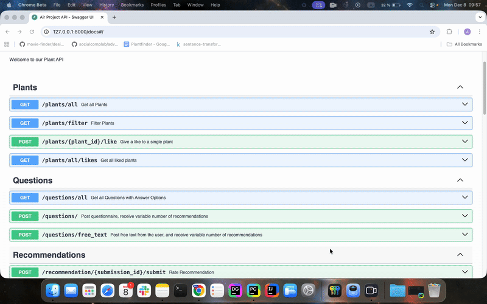

# 🌱 AIR Plant Project

A fancy application that handles advanced information retrieval. This project is designed to process a dataset and expose functionality via a FastAPI backend and a wonderful frontend.

## Overview
Plant Finder is a full-stack plant recommender system that helps users discover suitable plants baded on their own preferences. 
They can filter plants, or find them based on structured questions or free-text descriptions.
Plant Finder combines modern frontend UI with an intelligent backend, and advanced information retrieval, based on BM25 and SBERT.

## Here a fancy demo of our project, yay (placeholder)
### Later we can put a frontend video here! 

  

 
 

## Frontend
### Key Features
- Modern responsive UI
- Search and Filter interface
- Interactive recommendation results
- Users can like plants, rate recommendations and submit feedback

 

## Backend
### Key Features
- Provision and preparation of dataset
- REST API endpoints for plant retrieval, filtering and recommendation
- Provides and runs the ranking pipelines with the algorithms BM25 and SBERT
- Stores user actions (likes, ratings, study results)
- Handles structured queries and natural language free text queries

## Core Features of Plant Finder

- Get all available plants
- Filter Plants: by ... more description
- Hybrid recommendation system: 
  - more infos here about bm25 and sbert
- User Interaction:
  - likes, ratings,... more description

## User Study Module
At the end of our workflow, users participate in a built-in user study:

... more info here please

 

------

## 📂 Project Structure
To make the project run, follow these main steps. For further project configuration, look into the corresponding README files in the folders `backend/README.md` and `frontend/README.md`

1. Run the API on localhost
2. Start the Frontend application, while accessing the API at `http://127.0.0.1:8000`

3. Folder Structure??
4. Tech Stack??

