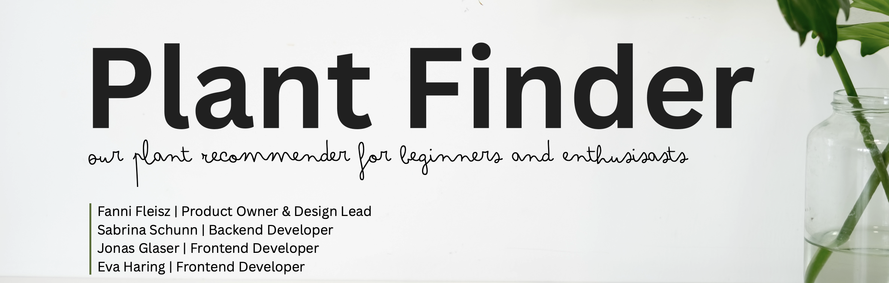
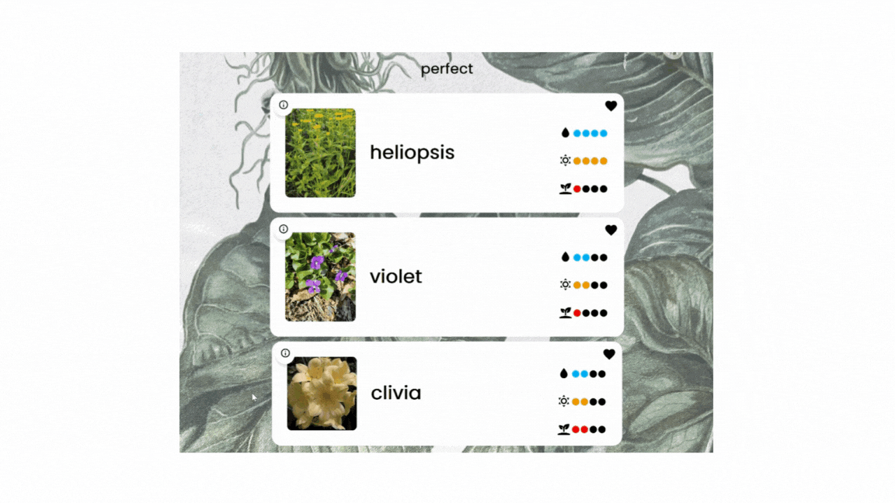
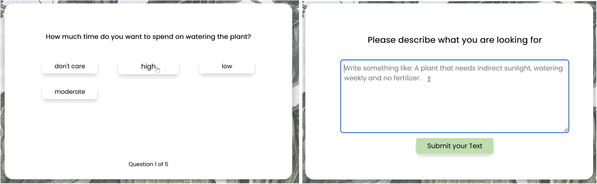
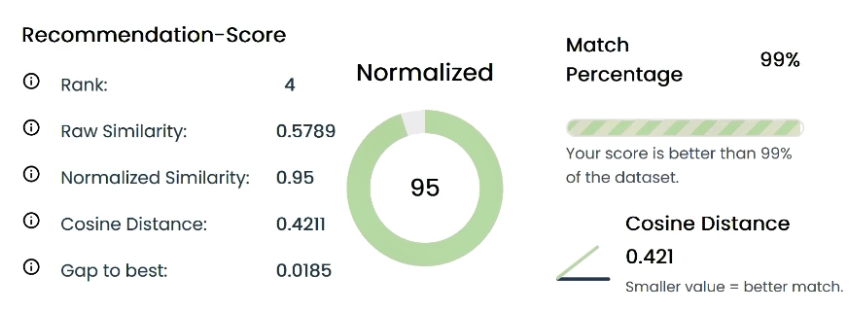
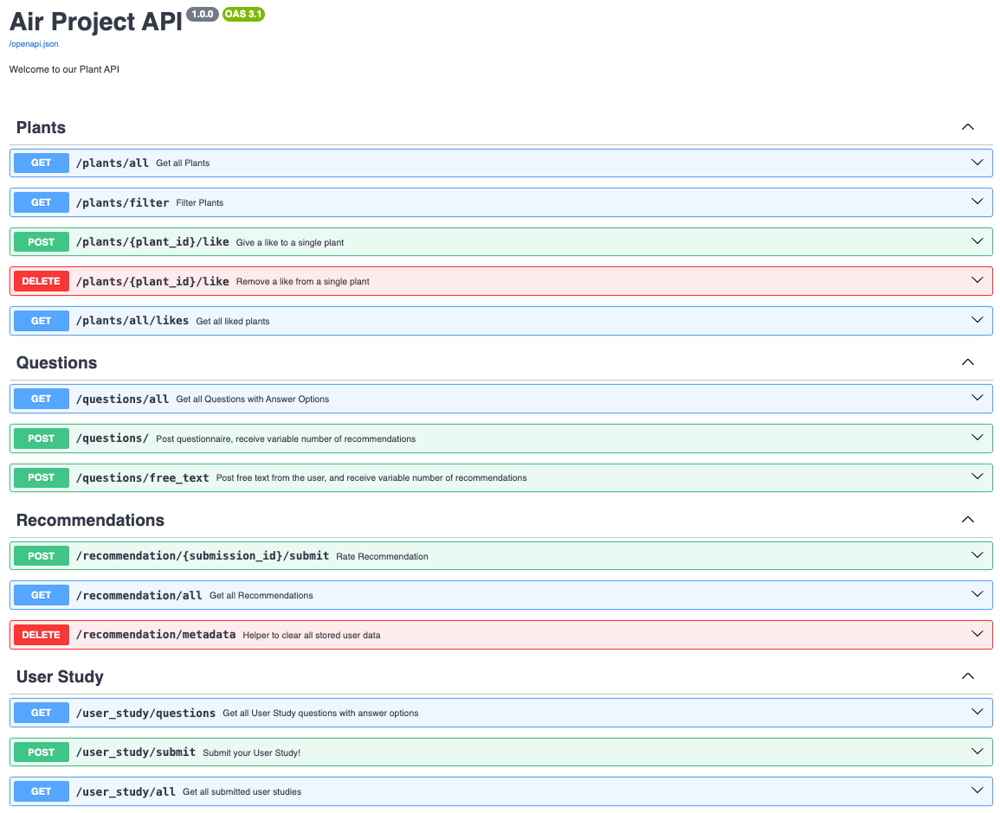

  

## 1. Overview
Plant Finder is a full-stack plant recommender system that helps users discover suitable plants based on their own preferences. 
Users can filter plants, or find them based on structured questions or free-text descriptions.
Plant Finder combines modern frontend UI with an intelligent backend, and advanced information retrieval, based on BM25 and S-BERT.

### 1.1. Motivation:
Plant care information online is often scattered or inconsistent, and users need a quick, relieable way to find requirements for specific plants. 
We explore whether semantic retrieval can improve search quality for plant-related queries.

### 1.2. Research Questions:

- Can a Transformer-based model (S-BERT) retrieve plant information more effectively than BM25?
- Does semantic understanding improve ranking relevance for natural-language queries?
- Can semantic retrieval enhance personalized recommendations in plant information systems?

### 1.3. Used Dataset:
- Plants Growth and Care Recommendations (Kaggle) with ~600 plant entries
- Additional images fetched from Trefle API and Wikipedia API

### 1.4. Retrieval Pipeline:
- BM25 (baseline) for keyword-based scoring and fast and exact matches
- S-BERT (semantic) for embedded queries, capturing contextual meaning

 

## 2. Frontend
We built the frontend with a strong focus on design and usability, to enable users to quick search,
filter, and explore plants. Recommendations and the corresponding results are presented clearly. Even scientific
measures (like ranking or cosine similarities) are presented in a user-friendly way.

  

### 2.1. Key Features
- Modern responsive UI
- Search and Filter interface
- Two recommendation approaches: **guided quiz** and **free-text** submission

  

- Easy to understand recommendation metrics

  

- Results are grouped after perfect fits/good fits and bad fits
- Users can like and rate plants and recommendations
- Rating functionality for recommendations and submitting feedback, as preparation for future user studies

 

## 3. Backend
The backend is a FastAPI based REST service that exposes structured endpoints for plant data,
user questions, recommendations and user study flows. To improve fast local development and frontend integration,
the raw dataset is preprocessed and then loaded into an in-memory SQLite database. 
`Pydantic` models provide strict request/response validation and consistent API schemas. Recommendation results
are generated by two different pretrained Kaggle models and implemented using `numpy`, `rank_mn25`, `PyTorch`, and `entence-transformers`.

  

### Key Features
- Provision and preparation of dataset
- REST API endpoints for plant retrieval, filtering and recommendation
- Provides and runs the ranking pipelines with the algorithms BM25 and SBERT
- Stores user actions (likes, ratings, study results)
- Handles structured queries 
- Handles natural language free text queries

------

## 📂 4. Project Structure & Running the Project
This repo is split into two main components:
- `backend/` --> FastAPI REST service
- `frontend/` --> Frontend web application

To run the project locally, start the backend first and then run the frontend.
Detailed setup instructions can be found in `backend/README.md` and `frontend/README.md`

1. **Start the backend API** (runs on `http://127.0.0.1:8000`)
2. **Start the frontend application**, configured to call the API at `http://127.0.0.1:8000`

